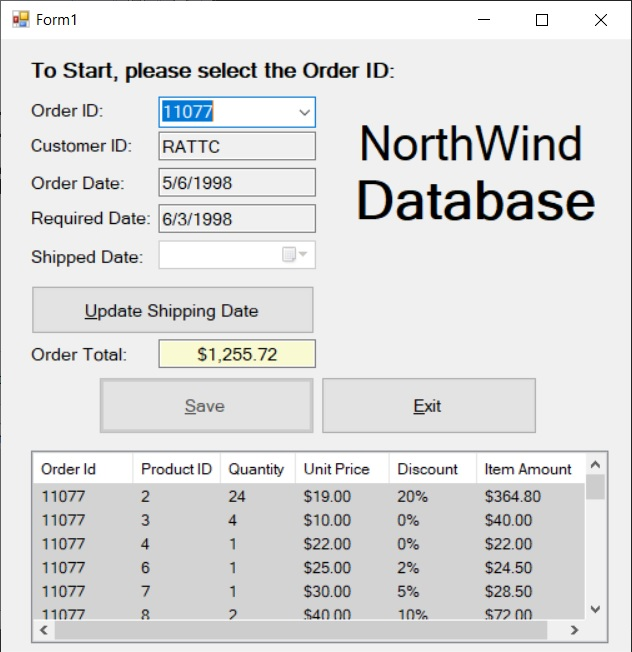

# CPRG-200-Lab-4

Write a 3-layer Windows Forms application that connects to the Northwind database and retrieves data from table Orders (only columns OrderID, CustomerID, OrderDate, RequiredDate, and ShippedDate) and Order Details (all columns).

For this lab you are not allowed to use datasets; instead, you are expected to write your code that works with ADO.NET objects in the connected model. Using object data source is OK, and so is using any other approach to database programming aslong as it is not SQL Data Sources and Datasets.

